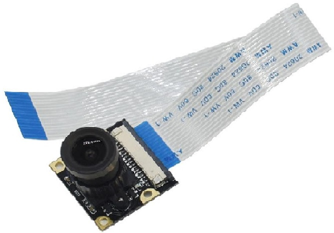

Features:

    - Esta camera é compatibel com qualquer versão de Raspberry Pi.
    - Pode-se ajustar-se dependendo da distancia.
    - 5 million pixels
    - OV5647 sensor chip
    
Camera parameters:
    
    - CCD Size: 1/4 inch
    - Aperture (F): 1.8
    - Focal length (Focal Length): 3.6mm (adjustable)
    - Viewing angle (Diagonal): 75.7 degrees
    - Best sensor pixels: 1080p
    4 screw holes:
    - It can be used in a fixed position
    - External support 3.3V power supply
    - Support infrared lamp access or fill light
    - Size: 25mm x 24mm
