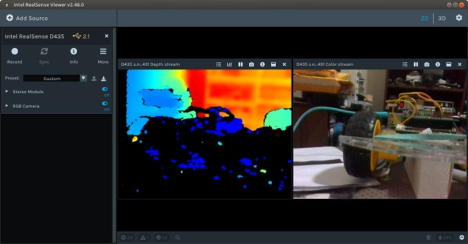
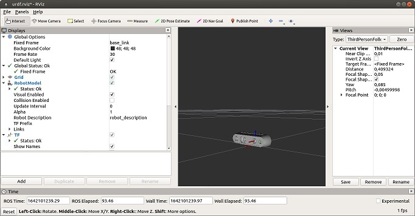

## Instalação da camara Intel RealSense

Dada a dificuldade em obter a catpação de imagem e respetivo tratamento ao mesmo tempo que se processa a informação dos nos ROS, foi testada a instalação da camara e respetivos modulos ROS em diferentes sistemas, com o ojetivo de separar o processamento da imagem do contrlo do mocimento do 'utad_car'.

Os sistemas testados foram os seguintes:
- [Raspberry PI 3](#Instalação-da-camara-Intel-RealSense-no-Raspberry-PI-3)
- [Raspberry PI 4](#Instalação-da-camara-Intel-RealSense-no-Raspberry-PI-4)
- [Carta Nvidia Jetson Nano 2GB](#Instalação-da-camara-Intel-RealSense-na-carta-Nvidia-Jetson-Nano-2GB)
- PC Portatil

### Instalação da camara Intel RealSense no Raspberry PI 3
Para proceder á instalação desta camara no Raspberry PI 3 segui [estas instruções](https://dev.intelrealsense.com/docs/using-depth-camera-with-raspberry-pi-3#section-installation-instructions) a partir do ponto 2, tendo o cuidado de fazer o __update__ do sistema operativo mas não o __upgrade__ já que me interessava manter a versão 18.04 LTS.

A sequência de ações foi a seguinte:
- Download e unzip da última versão estável do ramo mestre: https://github.com/IntelRealSense/librealsense/archive/master.zip
- _Desconectar qualquer câmera Intel RealSense conectada_
- A partir da pasta __'librealsense'__ executar os seguintes comandos/scripts:

        sudo apt-get update 
        sudo apt-get install libglfw3-dev libgl1-mesa-dev libglu1-mesa-dev 
        ./scripts/setup_udev_rules.sh
        
        mkdir build && cd build
        cmake ../ -DCMAKE_BUILD_TYPE=Release -DBUILD_EXAMPLES=true -DBUILD_PYTHON_BINDINGS:bool=true -DFORCE_RSUSB_BACKEND=ON -DPYTHON_EXECUTABLE=/usr/bin/pyt
        sudo make uninstall && make clean && make -j1 && sudo make install
        
        sudo apt-get install qt5-default

Este processo é bastante demorado, em particular devido á opção __-j1__, no entanto esta opção é necessária em tendo em conta os recursos nomeadamente de memória disponíveis.

Nota: Nalguns casos, a capacidade de RAM não é suficiente para compilar o SDK, portanto, se o processo de compilação abortar com um código de erro, uma solução poderá ser criar  uma [‘sawp file’](./Swap%20files.md) e  recompilar o SDK

Depois de instalados o software da camara deverá ser possível testra a instalação recorrendo á aplicação __'realsense-viewer'__ executando o comando e obtendo o resultado seguintes:

        realsense-viewer

- Instalação dos modulos ROS para utilização da camara

        cd ~/catkin_ws
        sudo apt-get install ros-$ROS_DISTRO-realsense2-camera
        sudo apt-get install ros-$ROS_DISTRO-realsense2-description

- Depois de instalados o smodulos ROS pode-se executar os seguintes comandos e obter o resultado apresentado a seguir:

        export ROS_MASTER_URI=http://localhost:11311
        source ~/catkin_ws/devel/setup.bash
        cd ~/catkin_ws
        roslaunch realsense2_camera rs_d435_camera_with_model.launch

### Instalação da camara Intel RealSense no Raspberry PI 4
Para proceder á instalação desta camara no Raspberry PI 4 segui [estas instruções](https://answers.ros.org/question/363889/intel-realsens-on-ubuntu-2004-ros-noetic-installation-desription/). De notar que embora esta página já esteja ultrapassada para arquiteturas X86/AMD64, parecxeu-me a mais apropriada para a arquitetura ARM64.

A sequência de ações foi a seguinte:
- Download e unzip da última versão estável do ramo mestre: https://github.com/IntelRealSense/librealsense/archive/master.zip
- _Desconectar qualquer câmera Intel RealSense conectada_
- A partir da pasta __'librealsense'__ executar os seguintes comandos/scripts:

        sudo apt-get update
        sudo apt-get install guvcview git libssl-dev libusb-1.0-0-dev pkg-config libgtk-3-dev
        sudo apt-get install libglfw3-dev libgl1-mesa-dev libglu1-mesa-dev 
        sudo mkdir -p /opt/realsense
        
        cmake ../ -DFORCE_RSUSB_BACKEND=true -DBUILD_PYTHON_BINDINGS=false -DCMAKE_BUILD_TYPE=release -DBUILD_EXAMPLES=true -DBUILD_GRAPHICAL_EXAMPLES=true -DCMAKE_INSTALL_PREFIX=$REALSENSE_INSTALL_PREFIX
        sudo make uninstall && make clean && make -j1 && sudo make install
        
        sudo bash -c "echo /opt/realsense/lib > /etc/ld.so.conf.d/realsense.conf"
        
        sudo cp config/99-realsense-libusb.rules /etc/udev/rules.d/99-realsense-libusb.rules 
        sudo udevadm control --reload-rules && udevadm trigger
        
        echo "export realsense2_DIR=/opt/realsense/lib/cmake/realsense2" >> ~/.bashrc

Este processo é bastante demorado, em particular devido á opção __-j1__, no entanto esta opção é necessária em tendo em conta os recursos nomeadamente de memória disponíveis.

Nota: Nalguns casos, a capacidade de RAM não é suficiente para compilar o SDK, portanto, se o processo de compilação abortar com um código de erro, uma solução poderá ser criar  uma [‘sawp file’](./Swap%20files.md) e  recompilar o SDK

Depois de instalados o software da camara deverá ser possível testra a instalação recorrendo á aplicação __'realsense-viewer'__ executando o comando seguinte:

        /opt/realsense/bin/realsense-viewer

- Instalação dos modulos ROS para utilização da camara

        cd ~/catkin_ws
        git clone https://github.com/IntelRealSense/realsense-ros.git ~/catkin_ws/src/realsense-ros
        catkin_make

- Depois de instalados o smodulos ROS pode-se executar os seguintes comandos e obter o resultado apresentado a seguir:

        export ROS_MASTER_URI=http://localhost:11311
        source ~/catkin_ws/devel/setup.bash
        cd ~/catkin_ws
        roslaunch realsense2_camera rs_d435_camera_with_model.launch

### Instalação da camara Intel RealSense na carta Nvidia Jetson Nano 2GB

Com o objetivo de tirar o maximo partido das capacidades desta carta para processamenro de vídeo, o SO adoptado foi o retirado da imagem  __'jetson-nano-2gb-jp451-sd-card-image.zip'__.

Este SO apresenta a seguinte mensagem quando nos conectamos por SSH:

        Welcome to Ubuntu 18.04.5 LTS (GNU/Linux 4.9.201-tegra aarch64)

         * Documentation:  https://help.ubuntu.com
         * Management:     https://landscape.canonical.com
         * Support:        https://ubuntu.com/advantage
        This system has been minimized by removing packages and content that are
        not required on a system that users do not log into.

        To restore this content, you can run the 'unminimize' command.

Como se pode ver trata-se do Sistema operativo ubuntu 18.04.05 LTS com um nucleo GNU/Linux 4.9.201-tegra e uma arquitetura ARM64.

#### Instalação do vncserver na carta Nvidia Jetson Nano

Na sequência da instalação do servidor e do acesso por SSH, procedi ao comando __'unminimize'__ para permitir o acesso ao sistema com interface gráfico.
A instalação do acesso á distância quer por __xrdp__ quer por __VNC__ revelou-se de dificil configuração, pelo que acabei por seguir as instruçãoes [desta página](https://jinyaozhu.github.io/linux/2019/05/16/vnc.html), sem no entanto instalar outro servidor vnc ou outro desktop.

Os comando de configuração do serviço VNC foram os seguintes:

        vncserver
        vncserver -kill :1
        
        sudo vi ~/.vnc/xstartup
        
        #Alterar o conteudo do ficheiro 'xstartup' para:
                #!/bin/bash
                unset SESSION_MANAGER
                unset DBUS_SESSION_BUS_ADDRESS
                xrdb $HOME/.Xresources
                startlxde &
        
        # Arrancar o servidor 
        vncserver :1 -geometry 1360x768 -depth 24
        
        # Testar a ligação
        
        # Em caso de sucesso criar um serviço que arranque o servidor ao ligar
        
        sudo vim /etc/systemd/system/vncserver@.service
        
        #Alterar o conteudo do ficheiro para:        
                [Unit]
                Description=Start VNC server at startup
                After=syslog.target network.target

                [Service]
                Type=forking
                User=!!!user_name!!!
                Group=!!!user_name!!!
                WorkingDirectory=/home/!!!user_name!!!

                PIDFile=/home/!!!user_name!!!/.vnc/%H:%i.pid
                ExecStartPre=-/usr/bin/vncserver -kill :%i > /dev/null 2>&1
                ExecStart=/usr/bin/vncserver -depth 24 -geometry 1360x768 :%i
                ExecStop=/usr/bin/vncserver -kill :%i

                [Install]
                WantedBy=multi-user.target
        
        sudo systemctl daemon-reload
        sudo systemctl enable vncserver@1.service
        vncserver -kill :1
        sudo systemctl start vncserver@1
        sudo systemctl status vncserver@1
        
Não esquecer de substituir !!!user_name!!! pelo nome du utilizador do SO.

Após o último comando deverá surgir uma informação semelhante á seguinte:

#### Instalação do ROS na carta Nvidia Jetson Nano 

Neta carta, tendo em conta o SO em presença selecionou-se a instalação do ROS Melodic seguindo as instruções [desta página](http://wiki.ros.org/Installation/Ubuntu) e utilizando os seguintes comandos:

        sudo sh -c 'echo "deb http://packages.ros.org/ros/ubuntu $(lsb_release -sc) main" > /etc/apt/sources.list.d/ros-latest.list'
        sudo apt install curl
        curl -s https://raw.githubusercontent.com/ros/rosdistro/master/ros.asc | sudo apt-key add -
        sudo apt update
        sudo apt install ros-melodic-desktop-full
        echo "source /opt/ros/melodic/setup.bash" >> ~/.bashrc
        source ~/.bashrc
        sudo apt install python-rosdep python-rosinstall python-rosinstall-generator python-wstool build-essential
        sudo apt install python-rosdep
        sudo rosdep init
        rosdep update
        mkdir -p ~/catkin_ws/src
        cd ~/catkin_ws/
        catkin_make
        source devel/setup.bash

#### Instalação da camara Intel Realsense

Para proceder á instalação desta camara a carta __Nvidia Jetson Nano__ segui [estas instruções](https://github.com/IntelRealSense/librealsense/blob/development/doc/installation.md). Utilizando os seguintes comandos:

