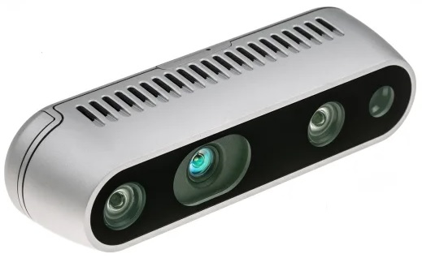

## Camara Intel® RealSense™ D435

A camara Intel® RealSense ™ Depth Camera D400 Series usa visão estéreo para calcular a profundidade. O modelo D435 é uma câmera de profundidade alimentada por USB que consiste num par de sensores de profundidade, um sensor RGB e um projetor de infravermelhos.

É ideal para aplicações que necessitem da capacidade de percepção de profundidade.

Este modelo apresenta:

- Um poderoso processador de visão que usa tecnologia de processo de 28 nanômetros (nm) e suporta até 5 MIPI
- Camera Serial Interface 2 pistas para processar imagens de profundidade em tempo real e acelerar a saída.
- Novo algoritmo de profundidade estéreo avançado para percepção de profundidade precisa.
- Um conjunto de sensores de imagem que permite a captura da disparidade entre imagens com resolução de até 1280 x 720.
- Suporte para diversas plataformas  e código-fonte aberto Intel® RealSense ™ SDK 2.0.
- Processador de sinal de imagem a cores dedicado para ajustes de imagem e dimensionamento de dados de cores.
- Projetor infravermelho ativo para iluminar objetos para melhorar os dados de profundidade.

A câmera de profundidade Intel® RealSense ™ D435 foi projetada para se adequar diferentes tipos de projetos. Com o obturador de imagem global e amplo campo de visão (85,2 ° x 58 ° x 94 °), a câmera de profundidade Intel® RealSense ™ D435 oferece percepção de profundidade precisa quando o objeto está em movimento ou é a camara que está em movimento, e cobre mais área, minimizando “pontos cegos".

Para mais informações sobre as câmeras de profundidade Intel® RealSense ™ e a tecnologia Intel® RealSense ™, visite [esta](https://www.intelrealsense.com/) página.

A versão mais recente do Intel® RealSense ™ SDK 2.0 está disponível [nesta](https://github.com/IntelRealSense/librealsense/) página do GitHub.

Caracteristicas da camara:

                                     Use Environment  Indoor/Outdoor
                                        Image Sensor  Technolog	Global Shutter
                                         Ideal Range  .3 m to 3 m
                                    Depth Technology  Stereoscopic
    Minimum Depth Distance (Min-Z) at Max Resolution  ~28 cm
                                      Depth Accuracy  <2% at 2 m
                           Depth Field of View (FOV)  87° × 58° (±3°)
                      Depth Stream Output Resolution  Up to 1280 × 720
                      Depth Stream Output Frame Rate  Up to 90 fps
                                RGB Frame Resolution  1920 × 1080
                                      RGB Frame Rate  30 fps
                               RGB Sensor Technology  Rolling Shutter
                                      RGB Sensor FOV  69° × 42°
                               RGB Sensor Resolution  2 MP
                                       Camera Module  Intel RealSense Module D430 + RGB Camera
                              Vision Processor Board  Intel RealSense Vision Processor D4
                                         Form factor  Camera Peripheral
           Camera Dimension(Length × Depth × Height)  90 mm × 25 mm × 25 mm
                                          Connectors  USB-C* 3.1 Gen 1*
                                  Mounting Mechanism  – One 1/4‑20 UNC thread mounting point
                                                      – Two M3 thread mounting points
