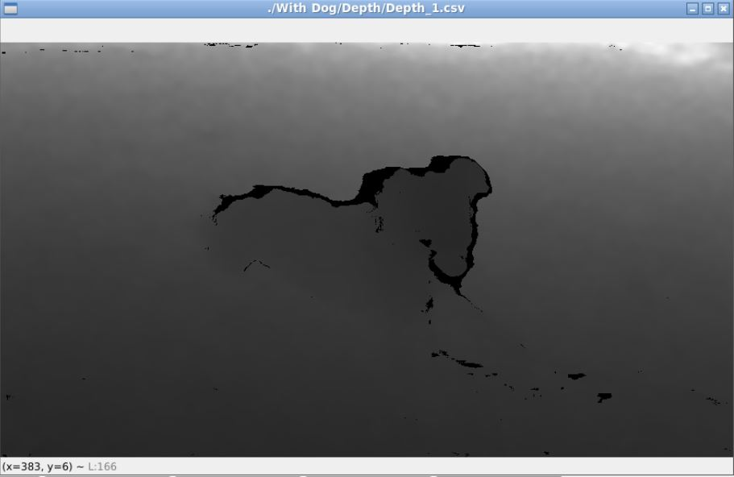

## Processamento de Imagem

O processamento de imagem é essencial ao estudo de qualquer sistema de navegação autónoma.

Desde as aplicações mais simples como o seguimento de trajetos previamente definidos, como é o caso dos chamados veículos filo guiados, até ao seguimento de objetos móveis ou ao mapeamento e posicionamento dos robots em mapas, o processamento de imagens pode ser utilizado para a definição de trajetórias e instruções se movimentação.

O processamento de imagem pode ainda ser utilizado na deteção de obstáculos que obriguem á paragem ou alteração de trajetória de um robot.

Neste trabalho foram abordados os seguintes temas:

- [Conversão de ficheiros CSV em ficheiro de imagems](#conversão-de-ficheiros-csv-em-ficheiro-de-imagems)
- [Separação de um objeto numa imagem]()

No estudo das aplicações de processamento de imagem, utilizei a linguagem Python.

### Conversão de ficheiros CSV em ficheiro de imagems
A utilização da informação da profundidade de cada pixel (distancia do ponto na imagem captada á camara) que normalmentre é fornecida em ficheiros CSV, em simultaneo com a informação RGB da imagem captada, motivou a criação de uma função que permitisse fazer essa leitura e posterior tratamneto.

Como ferramneta de verificação do conteudo de ficheiros CSV com esse tipo de informação criei a função [le-image-CSV.py]() que permite visualizar numa imagem em tons de cinzento a profundidade de cada pixel.

Exemplo de utilização:

    ./le-image-CSV.py ./'With Dog'/Depth/Depth_1.csv

Resultado:

