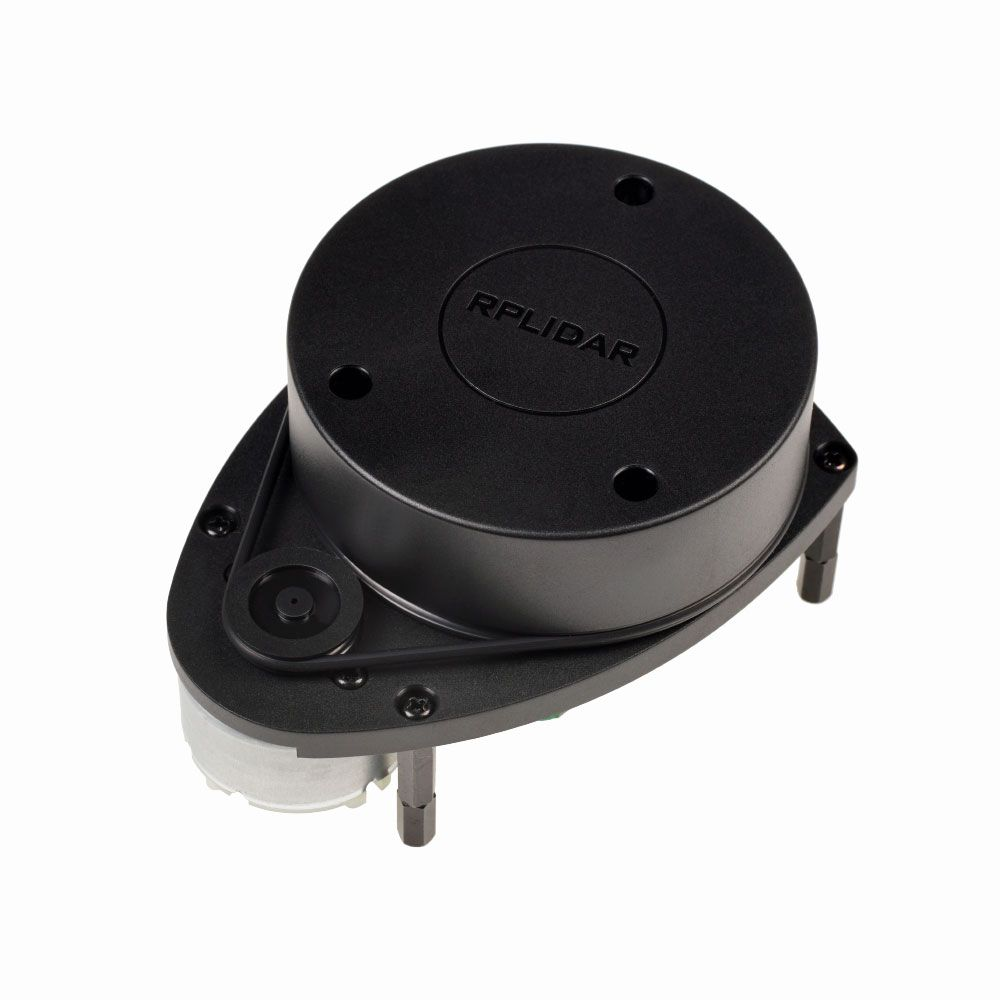

## RPLiDAR A1M8-R6 360-degree Laser Scanner Kit

O RPLIDAR A1 é uma solução de scanner a laser 2D de 360ºgraus (LIDAR) de baixo custo. O sistema pode realizar uma varredura de 360ºgraus no intervalo de 12 metros. Os dados de nuvem de pontos 2D produzidos podem ser usados em mapeamento, localização e modelagem de objeto / ambiente.

A frequência de varredura do RPLIDAR A1 atingiu 5,5 Hz ao amostrar 1450 pontos a cada rodada. E pode ser configurado em até 10 Hz no máximo.

RPLIDAR A1 é basicamente um sistema de medição de triangulação a laser. Pode funcionar excelente em todos os tipos de ambiente interno e externo sem exposição direta à luz solar.
