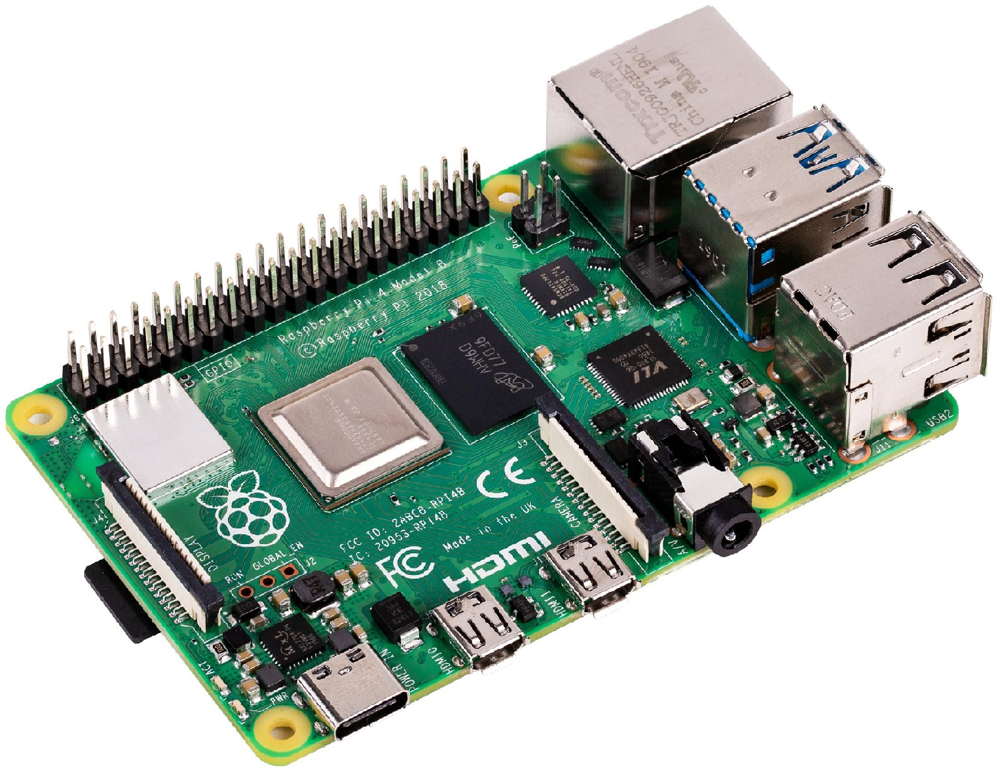

## Raspberry PI 4

(cat /proc/cpuinfo)

                 Model: Raspberry Pi 4 Model B Rev 1.

            Processors: 4
              BogoMIPS: 108.00
              Features: fp asimd evtstrm crc32 cpuid
       CPU implementer: 0x41
      CPU architecture: 8
           CPU variant: 0x0
              CPU part: 0xd08
          CPU revision: 3

              Hardware: BCM2835
              Revision: c03112
                Serial: 1000000077cc0d0c
                 Model: Raspberry Pi 4 Model B Rev 1.2
 
(cat /proc/meminfo)

              MemTotal: 3884324 kB

(dpkg --print-architecture)

            arm64

OS:

(uname -a)

           Linux rpi4 5.4.0-1047-raspi #52-Ubuntu SMP PREEMPT Wed Nov 24 08:16:38 UTC 2021 aarch64 aarch64 aarch64 GNU/Linux

(cat /etc/os-release)

                NAME = "Ubuntu"
             VERSION = "20.04.2 LTS (Focal Fossa)"
                  ID = ubuntu
             ID_LIKE = debian
         PRETTY_NAME = "Ubuntu 20.04.2 LTS"
          VERSION_ID = "20.04"
    VERSION_CODENAME = focal
     UBUNTU_CODENAME = focal

(lsb_release -a)

    No LSB modules are available.

      Distributor ID: Ubuntu
         Description: Ubuntu 20.04.2 LTS

             Release: 20.04
            Codename: focal

(hostnamectl)

     Static hostname: rpi4
           Icon name: computer
          Machine ID: 0f314813462c45599e46b4825c222602
             Boot ID: 45fe831cc2764fa48426dac216f3a48e
    Operating System: Ubuntu 20.04.2 LTS
              Kernel: Linux 5.4.0-1044-raspi
        Architecture: arm64
      
