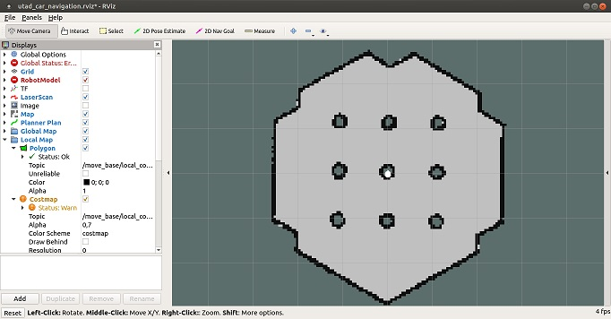

## SLAM (Simultaneous Localization and Mapping)

SLAM é uma técnica utilizada por robôs e veículos autônomos para construir um mapa de um ambiente ao mesmo tempo que se localiza.

__Mapeamento__

SLAM é geralmente referenciado pelo comunidade de robótica como um processo para criar mapas geometricamente consistentes e é adaptado ás informações disponíveis no ambiente, focado-se menos na perfeição que  na conformidade operacional.

__Percepção__

SLAM pode utilizar diferentes tipos de sensores para obter informações estatisticamente independentes para minorar os erros. Independência estatística é um requisito para trabalhar com informações parciais e com métricas contendo ruídos.

__Localização__

Os resultados da percepção alimentam os algoritmos da localização. Uma abordagem utilizando visão computacional, por exemplo, pode extrair pontos de referência do ambiente que podem ser utilizados pelo algoritmo de localização para determinar a posição atual no ambiente considerando os estados anteriores do sistema.

__Modelagem__

Como parte do modelo, a cinemática do robô é incluída, consequentemente melhorando as estimativas da percepção sob condições inerentes a ruídos. O modelo dinâmico balanceia contribuições de diferentes sensores, resultando numa representação virtual do ambiente com uma núvem de probabilidade.

### Utilização de SLAM no 'utad_car'

No 'utad_car' foi testado o dispositivo [__RPLiDAR A1M8__](./RPLiDAR%20A1M8.md).

Para utilização do __'utad_car'__ com ligação ao dispositivo LIDAR, deve-se [arrancar o modulo __'utad_car_navigation'__](#Arranque-do-modulo-utad_car_navigation), utilizando para isso o ficheiro [__'utad_car_navigation.launch'__](../ROS/catkin_ws/src/utad_car_navigation/launch/utad_car_navigation.launch).

Este modulo, para além de arrancar os modulos de controlo do movimento do __'utad_car'__ também arranca o modulo [__'hlds_laser_publisher'__](#Modulo-hlds_laser_publisher) que é o responsável pela comunicação com o dispositivo LIDAR.

No final do arranque do modulo __'utad_car_navigation'__ deverá abrir-se uma janela __RViz__ que permite interagir gráficamente com os modulos ROS ativos e que deverá ter um aspeto semelhante ao seguinte:

Devido á falta do cabo de ligação do dispositivo á placa de interface por USB não foi possível testar o funcionamento do dispositivo nem dos modulos ROS de alto nível de _mapeamento_ e de _planeamento de rotas_.

### Modulo 'hlds_laser_publisher'
O modulo ['hlds_laser_publisher'](../ROS/catkin_ws/src/hls_lfcd_lds_driver/src/hlds_laser_publisher.cpp) é o responsável pela comunicação com o dispositivo LIDAR.

Se durante o arranque surgir a seguinte mensagem:

        [ERROR] [1641892472.825334118]: An exception was thrown: open: No such file or directory
        [utad_car_lds-4] process has died [pid 9577, exit code 255, cmd /home/username/catkin_ws/devel/lib/hls_lfcd_lds_driver/hlds_laser_publisher \__name:=utad_car_lds \__log:=/home/username/.ros/log/dbb3b4d8-72be-11ec-b96c-b827ebba9e5d/utad_car_lds-4.log].
        log file: /home/username/.ros/log/dbb3b4d8-72be-11ec-b96c-b827ebba9e5d/utad_car_lds-4*.log

A comunicação com o dispositivo LIDAR é feita utilizando uma porta __USB__ pelo que se torna necesário garantir que a porta fica disponível para o respetivo driver, não sendo "tomada" por exemplo pelo _ModemManager_ do ubuntu.

### Arranque do modulo 'utad_car_navigation'

Para arrancar o modulo __'utad_car_navigation'__ deverão ser utilizados os seguintes comandos:

    source ~/catkin_ws/devel/setup.bash
    cd ~/catkin_ws
    roslaunch utad_car_navigation utad_car_navigation.launch

Estes comandos estão disponíveis no ficheiro [__'utad_car_lidar.sh'__](../ROS/utad_car_lidar.sh) que poderá ser executado diretamente a partir da linha de comando.

O ficheiro __'utad_car_navigation.launch'__ inclui instruções para arranque dos modulos a seguir indicados, incluindo parametros e argumentos necessários ao seu funcionamento:
- utad_car -> [/utad_car.launch](../ROS/catkin_ws/src/utad_car/launch/utad_car.launch)
    - utad_car_core -> [/utad_car_core.launch](../ROS/catkin_ws/src/utad_car_core/launch/utad_car_core.launch)
        - \<node pkg="utad_car_core" type="[motion](../ROS/catkin_ws/src/utad_car_core/nodes/motion)" name="motion" output="$(arg output)">
        - \<node pkg="utad_car_core" type="[odometer](../ROS/catkin_ws/src/utad_car_core/nodes/odometer)" name="odometer" output="$(arg output)">
    - utad_car_bringup -> [/utad_car_lidar.launch](../ROS/catkin_ws/src/utad_car_bringup/launch/utad_car_lidar.launch)
        - \<node pkg="hls_lfcd_lds_driver" type="[hlds_laser_publisher](../ROS/catkin_ws/src/hls_lfcd_lds_driver/src/hlds_laser_publisher.cpp)" name="utad_car_lds" output="screen">
- utad_car_bringup -> [/utad_car_remote.launch](../ROS/catkin_ws/src/utad_car_bringup/launch/utad_car_remote.launch) 
    - utad_car_bringup -> [/includes/description.launch.xml](../ROS/catkin_ws/src/utad_car_bringup/launch/includes/description.launch.xml)
    - \<node pkg="robot_state_publisher" type="[robot_state_publisher](../ROS/catkin_ws/src/robot_state_publisher/src/robot_state_publisher.cpp)" name="car_state_publisher">
- \<node pkg="map_server" name="map_server" type="[map_server](#Modulos-utilizados-que-fazem-parte-do-ROS)" args="$(arg map_file)"/>
- utad_car_navigation -> [/amcl.launch](../ROS/catkin_ws/src/utad_car_navigation/launch/amcl.launch)
    - \<node pkg="amcl" type="[amcl](#Modulos-utilizados-que-fazem-parte-do-ROS)" name="amcl">
- utad_car_navigation -> [/move_base.launch](../ROS/catkin_ws/src/utad_car_navigation/launch/move_base.launch)
    - \<node pkg="move_base" type="[move_base](#Modulos-utilizados-que-fazem-parte-do-ROS)" respawn="false" name="move_base" output="screen">
    - \<node pkg="rviz" type="[rviz](#Modulos-utilizados-que-fazem-parte-do-ROS)" name="rviz" required="true" args="-d $(find utad_car_navigation)/rviz/utad_car_navigation.rviz"/>

No final do arranque deverá ser possível verificar na consola onde foram executados os comandos a seguinte informação:

        NODES
          /
            amcl (amcl/amcl)
            car_state_publisher (robot_state_publisher/robot_state_publisher)
            map_server (map_server/map_server)
            motion (utad_car_core/motion)
            move_base (move_base/move_base)
            odometer (utad_car_core/odometer)
            rviz (rviz/rviz)
            utad_car_lds (hls_lfcd_lds_driver/hlds_laser_publisher)

        auto-starting new master
        process[master]: started with pid [10486]
        ROS_MASTER_URI=http://localhost:11311

        setting /run_id to ff5a7e7c-72d1-11ec-b96c-b827ebba9e5d
        process[rosout-1]: started with pid [10497]
        started core service [/rosout]
        process[motion-2]: started with pid [10500]
        process[odometer-3]: started with pid [10501]
        process[utad_car_lds-4]: started with pid [10506]
        process[car_state_publisher-5]: started with pid [10507]
        process[map_server-6]: started with pid [10513]
        process[amcl-7]: started with pid [10514]
        process[move_base-8]: started with pid [10515]
        process[rviz-9]: started with pid [10517]

### Modulos utilizados que fazem parte do ROS
No arranque do modulo __'utad_car_navigation'__ são utilizados os seguintes modulos que estão incluidos na instalação do ROS:
- 'map_server'
- 'amcl'
- 'move_base'
- 'rviz'

