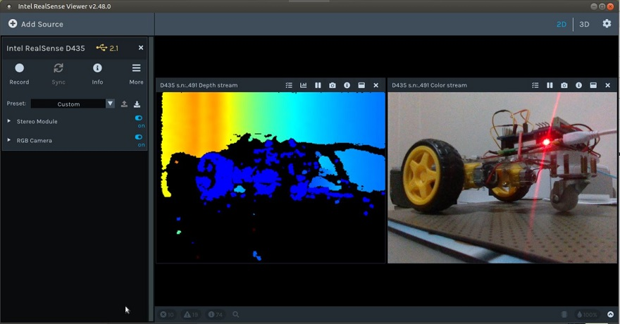
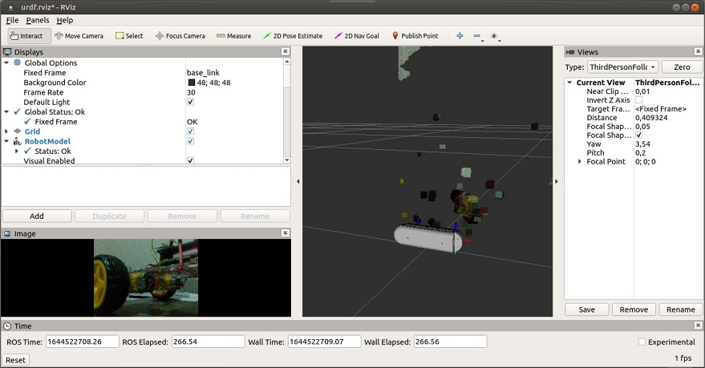
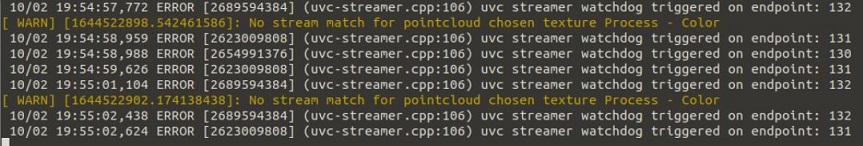
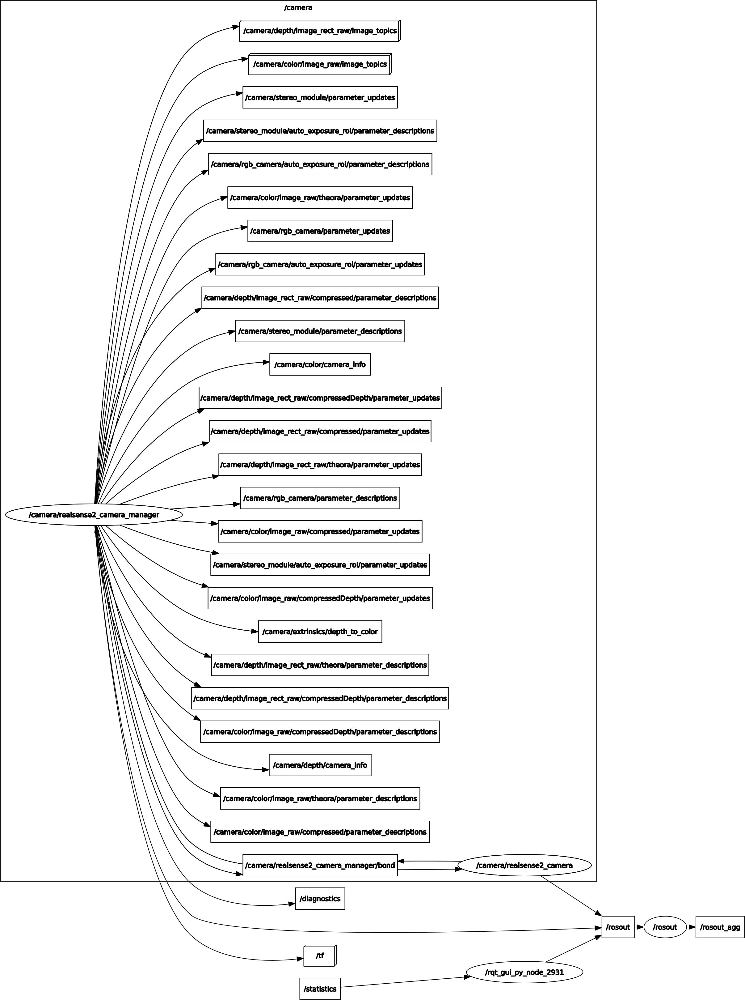
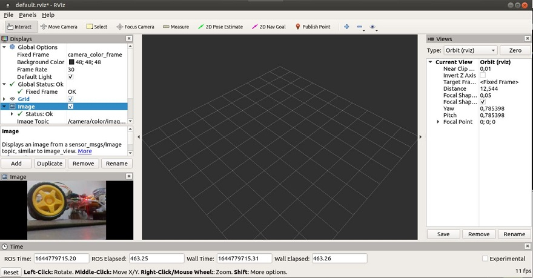

## Utilização da camara Intel RealSense
A utilização de camaras com capacidade de captação de imagem e informação de profundidade, como é o caso da [Intel RealSense](./Camara%20Intel%20RealSense.md), apresenta-se como uma alternativa a considerar nos sistemas de navegação autónoma.

Esta camaras para além da deteção da distância aos obstáculos permitem a identificação de marcas estáticas no seu ambiente, localizando-se a partir das mesmas ou localizar elementos móveis, permitindo o estabelecimento de trajetórias em função da sua localização relativa.

Para estudar o comportamento desta camara começou-se pela [sua instalação](./Instalação%20da%20camara%20Intel%20RealSense.md).

A primeira instalação foi feita no Raspberry PI 3, onde tentei obter os dados necessários para alimentar o modulo de mapeamento e de deteção de obstáculos.

A visualização de imagens com a aplicação __realsense-viewer__ funciona relativamente bem, sendo possível visualizar tanto a _'Depth stream'_ como a _'Color stream'_, como mostra a imagem seguinte:

No entanto quando se tenta obter imagens no ambiente ROS, utilizando o comando _roslaunch realsense2_camera rs_d435_camera_with_model.launch_ verifica-se que o mapeamento de pontos é muito deficiente apesar de estar com apenas 1 fps, como se pode observar na imagem seguinte:

Ao mesmo tempo que se visualiza esta imagem, na janela onde foi executado o comando são continuamente apresentados os erros seguintes:

Tendo em conta os resultados no _realsense-viewer_ e os resultados no _RViz_ admiti que uma das causas dos maus resultados e erros na utilização do _RViz_ poderia residir na falta de capacidade de processamento da imagem da camara ao mesmo tempo que é gerido o _ROS_ no _Raspberry PI 3_. Por esse motivo explorei a possibilidade de separar a captação da imagem e o controlo de baixo nível do controlo de alto nível, instalando o ROS em dois locais, com processamento independente e comunicação pela rede LAN.

Foram assim estudadas as seguintes hipóteses de locais de processamento, admitindo que a captação de imagens se faria sempre ao nível do _Raspberry PI 3_:
- [Raspberry PI 4](#Processamento-no-Raspberry-PI-4)
- [PC Portatil](#Processamento-da-Imagem-no-PC-Portatil)
- [Carta Nvidia Jetson Nano](#Processamento-da-Imagem-na-Carta-Nvidia-Jetson-Nano)

Para utilizar outro local de processamento de alto nível é necessário ai arrancar com o _ROS_  como 'Master', sendo os módulos de baixo nível executados no _Raspberry PI 3_ com a indicação do endereço do 'Master'.

### Processamento no Raspberry PI 4

Para utilizar o _Raspberry PI 4_ como local de processamento de alto nível comecei por testar o modulo _realsense2_camera_ utilizando para o efeito o script [rpi4_rs2_camera.sh](../ROS/rpi4_rs2_camera.sh) para inserir os seguintes comandos:

      export ROS_MASTER_URI=http://rpi4.local:11311
      source ~/catkin_ws/devel/setup.bash
      cd ~/catkin_ws
      roslaunch realsense2_camera rs_camera.launch enable_sync:=true

Estes comando são inseridos no _Raspberry PI 3_ depois de se ter iniciado o ROS no _Raspberry PI 4_ 

Durante a fase de arranque são apresentadas as seguintes mensagens de inicialização:

      NODES
        /camera/
          realsense2_camera (nodelet/nodelet)
          realsense2_camera_manager (nodelet/nodelet)

      ROS_MASTER_URI=http://rpi4.local:11311

      process[camera/realsense2_camera_manager-1]: started with pid [21564]
      process[camera/realsense2_camera-2]: started with pid [21565]

Estas mensagens mostram a ligação ao Raspberry PI 4 e o arranque dos modulos 'realsense2_camera_manager' e 'realsense2_camera'.

No entanto surgem também outras mensagens das quais destaco as seguintes:

      [ INFO] [1644745893.948562581]: Device USB type: 2.1
      [ WARN] [1644745893.948712684]: Device 948122072491 is connected using a 2.1 port. Reduced performance is expected.

       13/02 09:51:41,473 ERROR [2657088528] (uvc-streamer.cpp:106) uvc streamer watchdog triggered on endpoint: 130

       13/02 09:51:41,733 WARNING [2781856784] (messenger-libusb.cpp:42) control_transfer returned error, index: 768, error: Resource temporarily unavailable, number: 11
      [ WARN] [1644745901.840760287]: Hardware Notification:Depth stream start failure,1.64475e+12,Error,Hardware Error

      [camera/realsense2_camera-2] process has finished cleanly

Como se pode ver pelas mensagens selecionadas o arranque do modulo 'realsense2_camera' termina devido aos erros de comunicação.

Tendo em conta que o _Raspberry PI 3_ não tem portas USB3 tentei a ligação em sentido inverso, ligando a camara no Raspberry PI 4, usando o Raspbery PI 3 como 'Master', tendo obtido os seguintes resultados:

Verifiquei que embora com alguns avisos o processo _realsense2_camera_ não terminava e no _Raspberry PI 3_ é possivel verificar os nós ativos,obetendo-se a seguinte informação:

      rosrun rqt_graph rqt_graph

      rosrun rviz rviz

Apesar da ligação da camara ao _Raspberry PI 4_ não ser a esperada (manteve-se a mensagem de ligação USB2.1 apesar da ligação ser feita numa porta USB3) a diferença de comportamente é de tal modo diferente que conclui que o problema está na ligação ao _Raspberry PI 3_.

Note-se que enquanto que com o _Raspberry PI 3_ apenas tinhamos 1 fps, com esta montagem chegamos a mais de 10 fps, mesmo tendo essas frames a psssar pela LAN.

### Processamento da Imagem no PC Portatil

A utilização do PC Portátil com local de processamento da imagem captada pelo _Raspberry PI 3_ acabou também por ser abandonada por não se conseguir melhor desempenho na ligação _Raspberry PI 3 -> PC Portátil_ que na ligação _Raspberry PI 3 -> Raspberry PI 4_.

### Processamento da Imagem na Carta Nvidia Jetson Nano

Como explicado no [modulo de instalação](../docs/Instalação%20da%20camara%20Intel%20RealSense.md#instalação-do-sdk-da-camara) da camara na __carta Nvidia Jetson Nano__ tendo em conta as dificuldades encontradas na instalação dos drivers da camara nessa placa acabei por abandonar a hipótese de utilização dessa carta para o processamento da imagem obtida no Raspberry PI 3.
